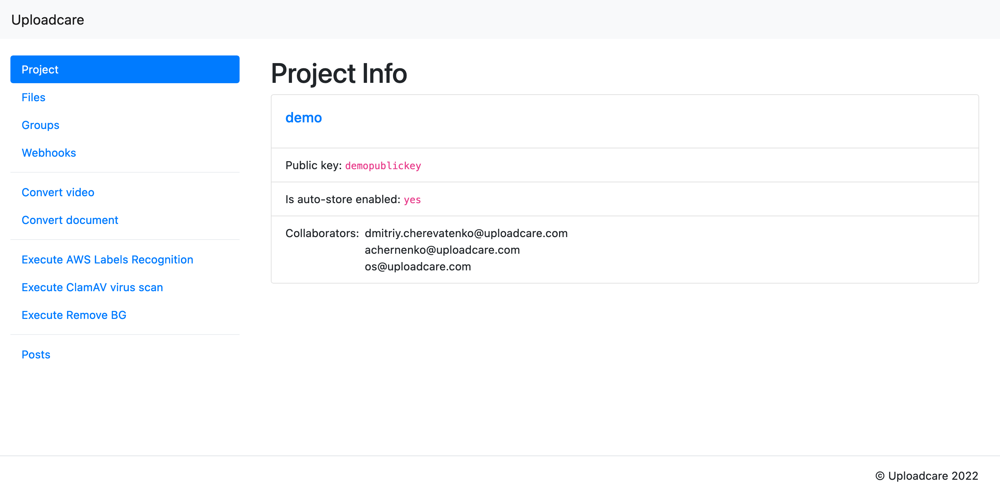
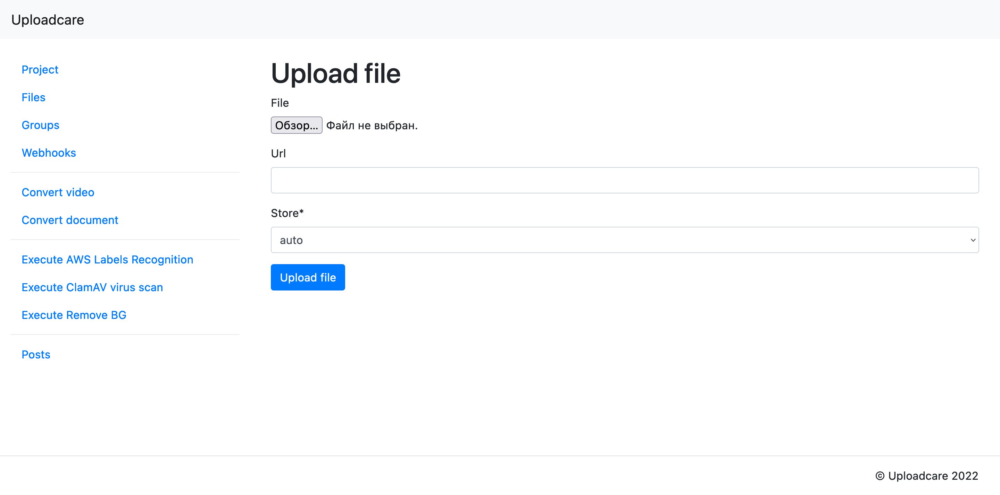
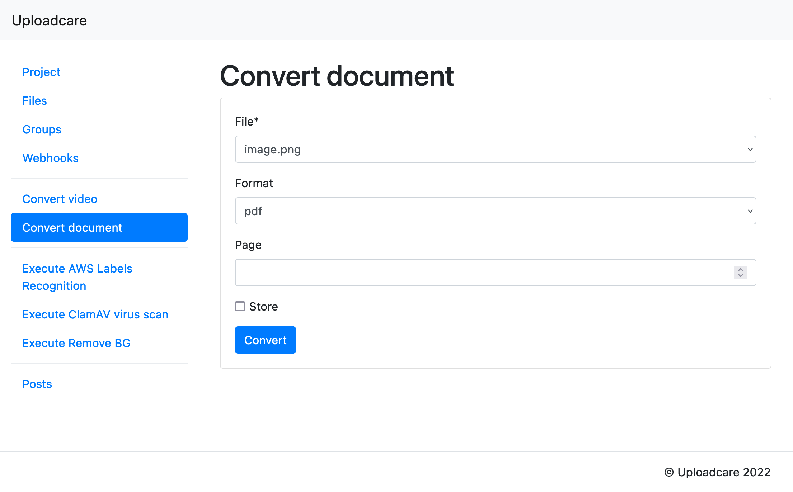
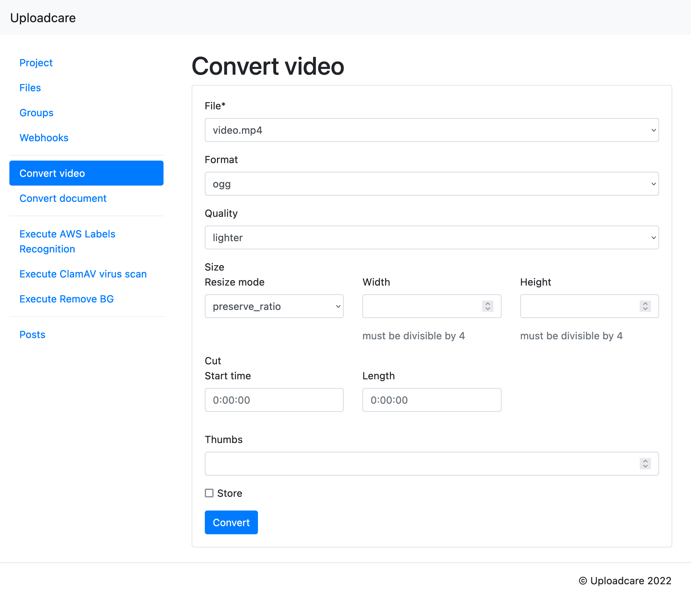
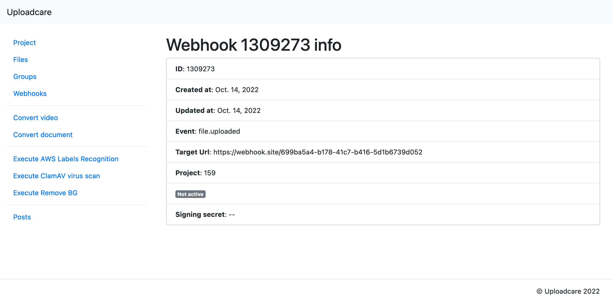
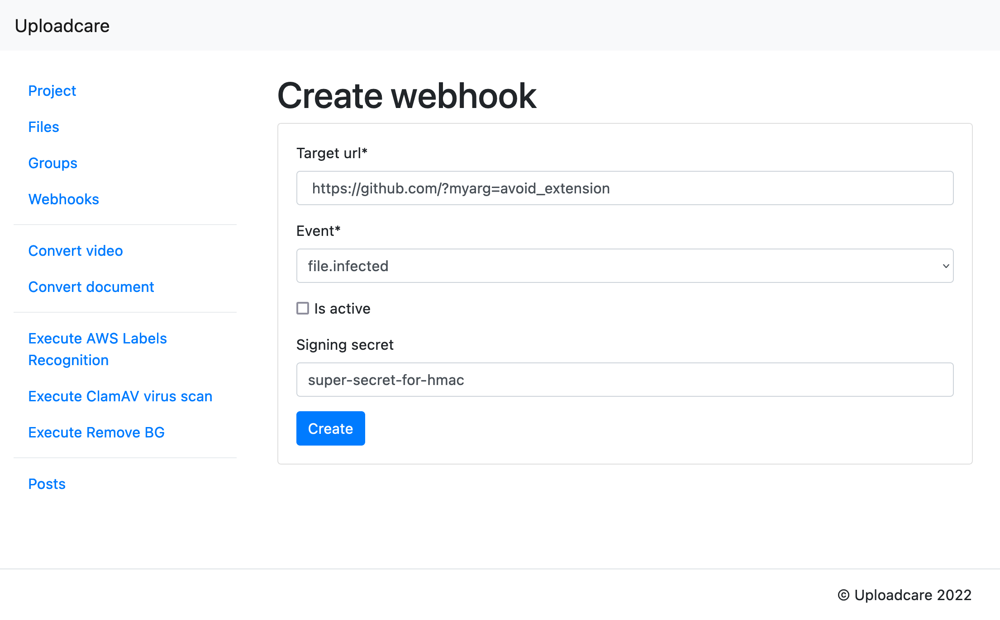

# Pyuploadcare Example app

This example project demonstrates the pyuploadcare capabilities.
The project is based on Python 3.12 and Django 4.2.10.

* [Installation](#installation)
  * [Using docker](#using-docker)
  * [Without docker](#without-docker)
* [Usage](#usage)
  * [Configuration](#configuration)
  * [Project section](#project-section)
  * [Files section](#files-section)
  * [File Groups section](#file-groups-section)
  * [Files uploading](#files-uploading)
  * [Conversion](#conversion)
    * [Documents conversion](#documents-conversion)
    * [Video conversion](#video-conversion)
  * [Webhooks](#webhooks)
  * [Posts section](#posts-section)
* [Useful links](#useful-links)

## Installation

### Using Docker

To install the example application you need to [install Docker Compose package](https://docs.docker.com/compose/install/).
When Docker Compose is installed, clone this repository and build a Docker image by using the `build` directive:

```console
$ git clone git@github.com:uploadcare/pyuploadcare-example.git
$ docker-compose build
```

This command will build an image for the application.

Also you need to prepare `secret.env` file with your public and secret keys
as environmental variables for docker container to use

```shell
# 1. Copy example into your local `secret.env`
cp secret.env.example secret.env

# 2. Fill the values with your favourite editor
```

When the image is ready — up the containers with the following command.
Migrations are applied on each container startup (look at `./app/start.sh`).

```console
$ docker-compose up -d
```

Now, the application must be available in your web-browser, on `http://localhost:8000`

### Without docker

First of all, clone this repository:

```console
$ git clone git@github.com:uploadcare/pyuploadcare-example.git
```

Make sure Python and Poetry are installed on your system. Fire command prompt and run command:

```console
$ python -V
Python 3.8.9
$ poetry --version
Poetry version 1.1.9
```

If Python or Poetry are not installed, check out following links with instructions, how to install those:
* [Install python](https://www.python.org/downloads/)
* [Install Poetry](https://python-poetry.org/docs/#installation)

Then install dependencies:

```console
$ poetry install
```

After dependencies are installed, apply database migrations:

```console
$ poetry run python app/manage.py migrate
```

Now, you can run the server:

```console
$ poetry run python app/manage.py runserver
```

and see the application available in your web-browser, on `http://localhost:8000`

## Usage

### Configuration

To start using tha application you need to set your API keys (public key and secret key).
These keys can be set as ENV variables using the `export` directive:

```console
$ export UPLOADCARE_PUBLIC_KEY=demopublickey
$ export UPLOADCARE_SECRET_KEY=demoprivatekey
```

### Project section

You can get the project information by your public key.



### Files section

This section contains operations with files. Such as uploading, copying, storing, deleting and creating file groups.
The page shows all the files you have on Uploadcare servers. Each file has actions, so it is possible to manage files on this page as well as on the `show` page.


To go to the `show` page, simply click on a filename.
There are blocks with readonly `appdata` and editable `metadata`:


The `index` page also supports batch operations pages — batch store, batch delete, create file group from selected files.
Just select multiple files and apply batch action.


### File Groups section

File Groups section provides user interface to manage file groups on Uploadcare.

The `index` page shows a minimal info about each group including ID and files count.
There is also a button for deleting the `group`


Click on a group ID, you go to the `show` group page:


### Files uploading

To upload file, click on `Upload` button in files index page. Then click `Choose file` on the form to upload local file or input file's URL.



### Conversion

The application can manage documents and video conversions sending request to [Uploadcare REST API Conversion endpoints](https://uploadcare.com/api-refs/rest-api/v0.6.0/#tag/Conversion).

---
**NOTE**

Remember, to convert files, your account must have this feature enabled. It means that your UPLOADCARE_PUBLIC_KEY and UPLOADCARE_SECRET_KEY (not demo keys) must be specified in environment variables. This feature is only available for paid plans.

---

#### Documents conversion

To convert a document, go to the `Convert document` section, choose a file to convert, target format and page (if the chosen target format is `jpg` or `png` and you want to convert a single page of a multi-paged document). There is a `Store` checkbox responsible for storing files as mentioned above.



After the form is submitted, you'll see a `Conversion result page`, which shows some info about conversion: `Status`, `Error` and link to the output file.
Updating the page will refresh the status.


#### Video conversion

Video conversion works the same way but the form has some additional parameters to set.



Conversion result page also includes information about how conversion is going.


### Addons

User can execute operations that wrapped as addons.
There are three implemented addons:
- background removing 
- virus scanning
- object recognition

For additional information proceed to [Uploadcare REST API Add-ons](https://uploadcare.com/api-refs/rest-api/v0.7.0/#tag/Add-Ons).


#### Object recognition via AWS

You only need to choose a file to start a recognition


After all corresponding part of file's `adddata` is rendered 
and you can get into full file information if needed


#### ClamAV Antivirus scan

Choose a file to scan and additional action for revealed infected file


Application renders corresponding part of file's `adddata` and the link to full file info page


#### Background removing

Background removing has a bunch of options to select.


Usually it takes time to remove the background especially for large images,
so you may see `IN_PROGRESS` status page with refresh button


Image with removed background will be put into new file, 
so the result page has both links to the original file and created one


### Webhooks

The `webhooks` section represents CRUD(create, read, update, delete) operations for Uploadcare webhooks.

---
**NOTE**

Remember, to manage webhooks, your account must have this feature enabled. It means that your UPLOADCARE_PUBLIC_KEY and UPLOADCARE_SECRET_KEY (not demo keys) must be specified in environment variables. This feature is only available for paid plans.

---

The menu button `Webhooks` points to the webhooks list page. Each list item has `edit/delete` actions and minimal info about a webhook.


Clicking on an ID of a list item redirects you to the `show` page of a webhook. Here you can find additional info and actions.



To create a new webhook, click the `Create a webhook` button in the menu. On the form, you should specify an URL for your webhook and check if it should be enabled immediately.



### Posts section

This section of the application made to demonstrate view helpers that allow to place Uploadcare File Uploader widget to a Django template.
The app has a model called Post and having fields `title`, `content`, `logo` and `attachments`. Logo and attachments represent `uploadcare.File` and `uploadcare.FileGroup` respectively.

Index page for posts shows a list of posts. Each list item has `edit/delete` actions.


Clicking on title will direct you to the `show` page of a post.


To create a new post, click on the `Add` button in posts index page. The post form will be opened. The form contains a text fields for post title and content, one File Uploader — for post's logo and one — for post's attachments. These File Uploaders differ from each other by the `multiple` option. For logo it is `false`, and for attachments — `true`.


## Useful links
* [Uploadcare documentation](https://uploadcare.com/docs/?utm_source=github&utm_medium=referral&utm_campaign=pyuploadcare)  
* [Upload API reference](https://uploadcare.com/api-refs/upload-api/?utm_source=github&utm_medium=referral&utm_campaign=pyuploadcare)  
* [REST API reference](https://uploadcare.com/api-refs/rest-api/?utm_source=github&utm_medium=referral&utm_campaign=pyuploadcare)  
* [Contributing guide](https://github.com/uploadcare/.github/blob/master/CONTRIBUTING.md)  
* [Security policy](https://github.com/uploadcare/pyuploadcare/security/policy)  
* [Support](https://github.com/uploadcare/.github/blob/master/SUPPORT.md)
* [A Python library for Uploadcare service](https://github.com/uploadcare/pyuploadcare)
